# Herald — Visual Guide

A screenshot walkthrough of every part of the module, companion to the
main [README](../README.md). Sections follow the same order as the
README's Usage section.

*Skeleton — drop screenshots into `assets/images/` using the suggested
filenames below (or your own naming, just update the paths here to
match), and fill in each section as you capture them.*

---

## Triggering

**Token HUD** — right-click a placed token, click the bullhorn icon.

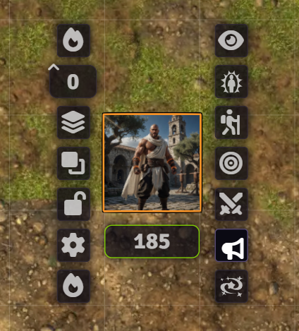

**Actor Directory** — right-click an actor in the sidebar, click
"Herald" in the context menu.

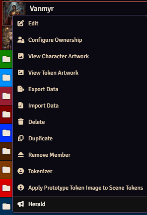

**The result** — the animated card itself, showing the portrait,
message, and subtext.

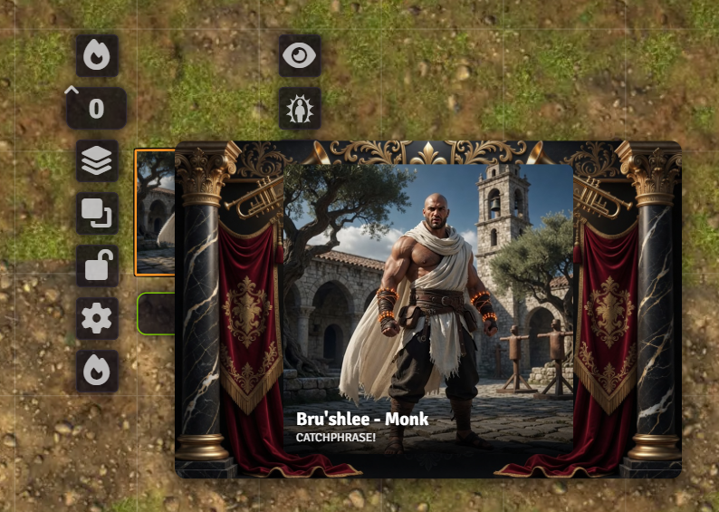

**Chat Card** — the same card and text is added to the chat, enabled by default this feature can be disabled within the foundry settings.

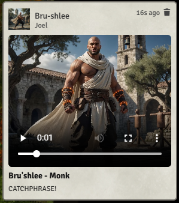

---

## Settings — Message & Subtext

The field-picker dropdown inserts a `{{path}}` token at the cursor
position in whichever text field it's next to — static text and live
actor data mix freely in one message.

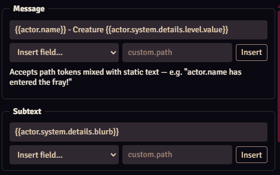

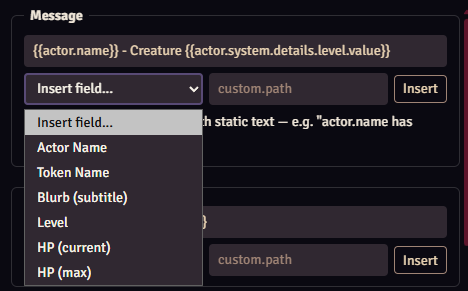

---

## Settings — Portrait Source

Avatar, Token, or Custom — Token reads whatever's actually configured in
the token's texture slot, image or video, whichever it is.

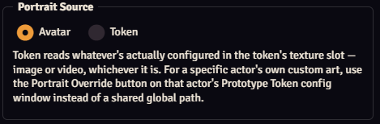

---

## Settings — Backdrop

None, Color, or Image, plus a shape selector (Portrait / Landscape /
Square) once a backdrop is set.

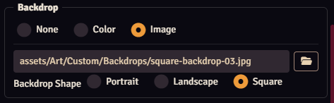

---

## Settings — Animation & Position

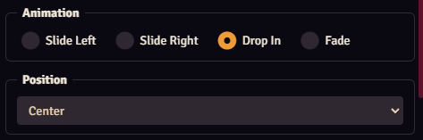

---

## Settings — Audio & Timing

An independent audio track, a Mute Audio override that always wins
regardless of source, and a duration (0 = manual close).

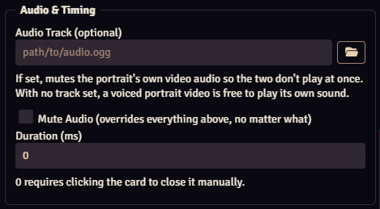

---

## Settings — Preview

Pick a sample actor and see exactly what triggering would produce,
without saving or broadcasting to anyone else.

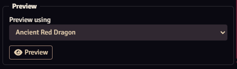

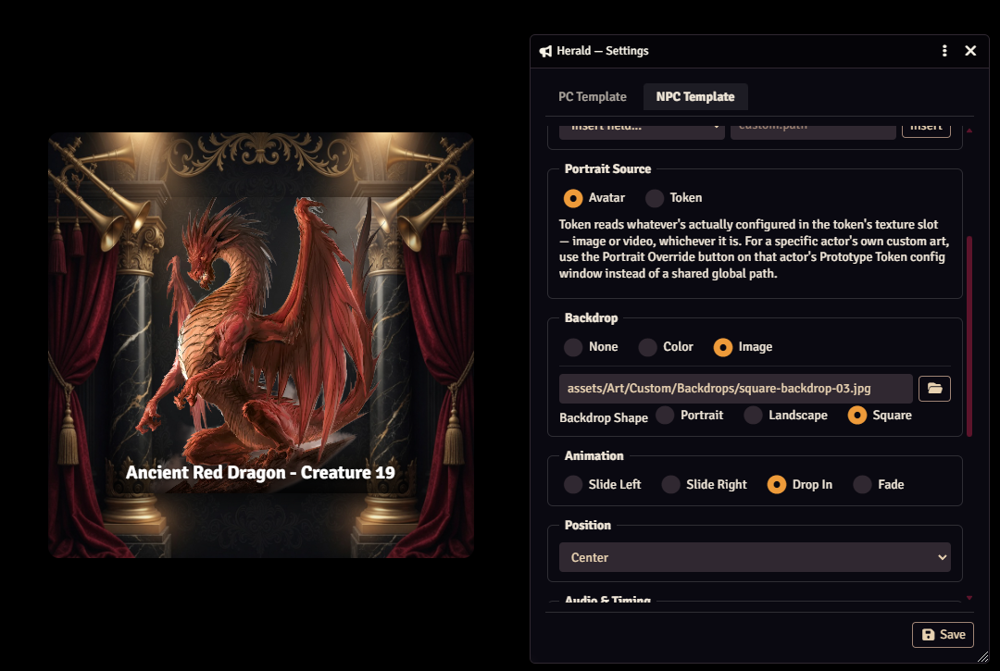

---

## Per-Actor Portrait Override

A small icon button on the Prototype Token config window's own title
bar — overrides just that actor's portrait, independent of whatever the
global template's Portrait Source is set to.

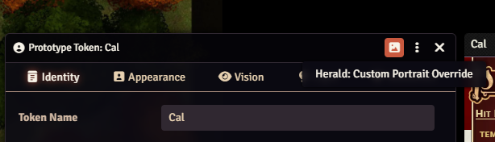

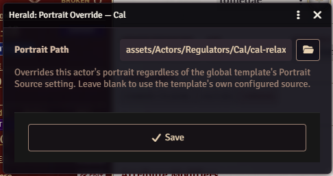

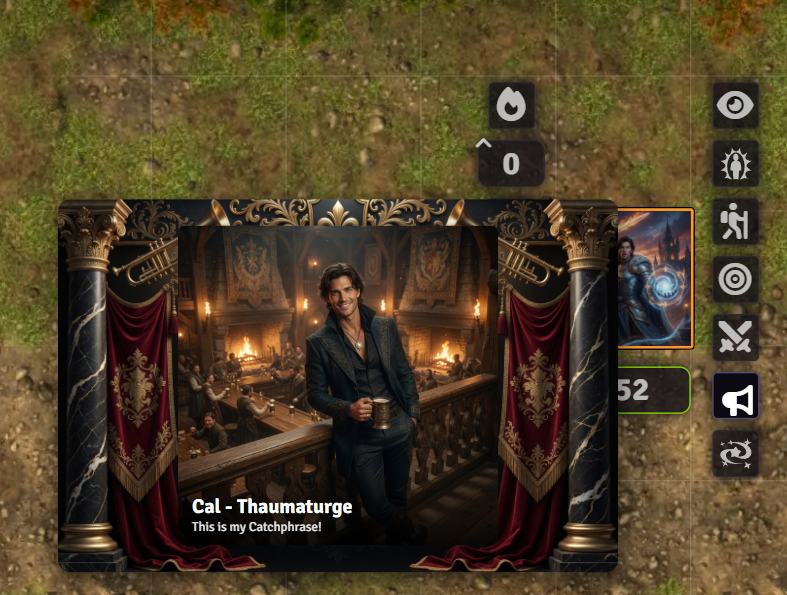

---

*Screenshots may lag slightly behind the latest UI copy/wording as the
module evolves — the [README](../README.md) is the source of truth for
current behavior if the two ever disagree.*
